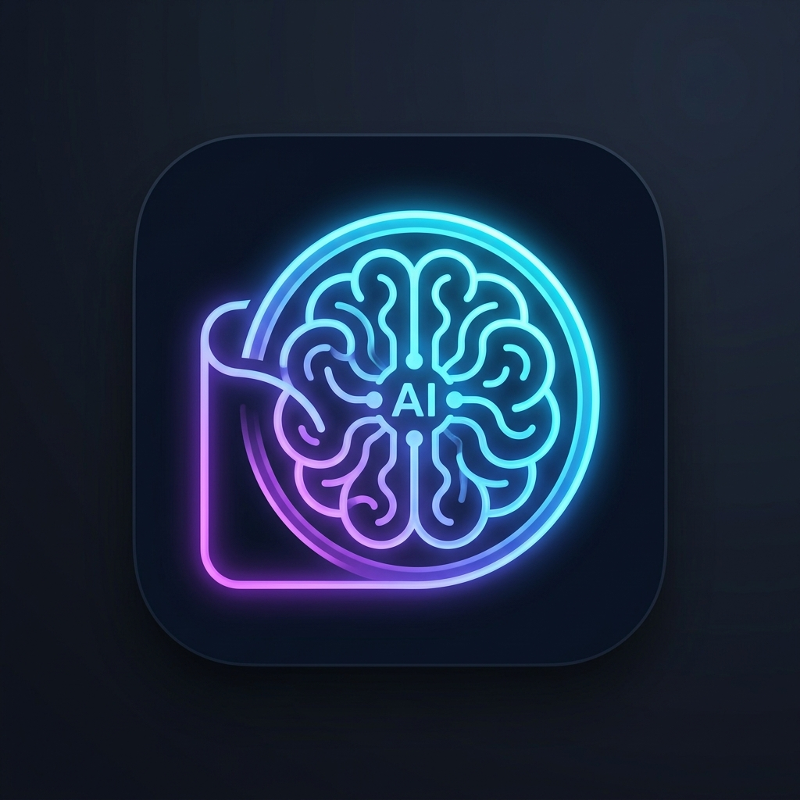
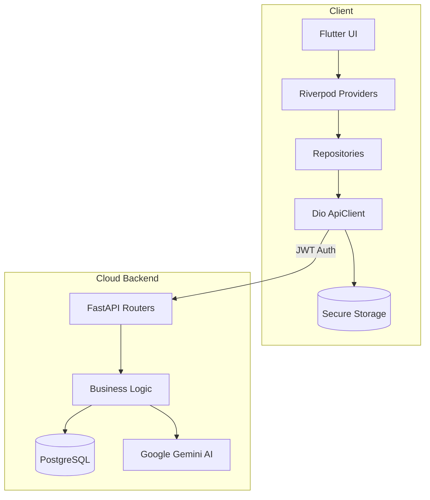

# 📱 FINTELIA

<div align="center">
  
  <h3>The Next-Generation AI Behavioral Personal Finance App</h3>
  <p><strong>FINTELIA</strong> uses Google Gemini to analyze your spending, calculate your financial DNA, and automate data entry via Receipt OCR & Voice commands—all wrapped in a premium modern fintech UI.</p>
</div>

---

## ✨ Key Features

- **🧠 Conversational AI Assistant**: Chat with FINTELIA to analyze your weekly spending, ask questions about your budget, or get AI-driven savings advice.
- **🧬 Financial DNA Profiling**: The app continuously learns your behavioral spending habits, scoring your impulsivity and risk tolerance to tailor specific goals to your unique personality.
- **📸 Receipt OCR & Voice Entry**: Automatically extract transactions from pictures of your receipts using computer vision, or simply say "I spent $15 on coffee" to log expenses instantly.
- **📊 Premium Analytics Dashboard**: Beautiful, 60fps implicit animations, dynamic charts, and Shimmer-loaded skeletons provide a highly responsive, Apple/Stripe-tier visual experience.
- **🔒 Bank-Grade Security**: Built with JWT authentication, encrypted secure storage, and strict ProGuard minification for production readiness.

## 🛠 Tech Stack

### Frontend (Mobile App)
- **Framework**: [Flutter](https://flutter.dev/) (Dart 3.7+)
- **State Management**: [Riverpod](https://riverpod.dev/) (Code-generated)
- **Routing**: `go_router` (ShellRoutes for Bottom Navigation)
- **Networking**: `dio` (with custom Auth/Retry/Error Interceptors)
- **UI/Charts**: `fl_chart`, `flutter_animate`, `shimmer`

### Backend (Cloud API)
- **Framework**: [FastAPI](https://fastapi.tiangolo.com/) (Python 3.10+)
- **AI Engine**: Google Gemini Pro & Gemini Vision (via `google-generativeai`)
- **Database**: PostgreSQL with SQLAlchemy ORM and Alembic migrations
- **Authentication**: JWT (JSON Web Tokens) with Argon2 password hashing
- **Deployment**: Dockerized with Gunicorn + Uvicorn Async Workers

## 🚀 Getting Started (Local Development)

### Prerequisites
- Flutter SDK 3.29.0+
- Python 3.10+ (for the backend)
- A Google Gemini API Key

### 1. Backend Setup
```bash
cd backend
python -m venv venv
source venv/bin/activate  # On Windows: venv\Scripts\activate
pip install -r requirements.txt

# Create a .env file and add your GEMINI_API_KEY and DATABASE_URL
uvicorn app.main:app --reload
```

### 2. Frontend Setup
```bash
cd fintelia
flutter pub get

# Create a .env file in the root
# API_BASE_URL=http://127.0.0.1:8000/api/v1 (or 10.0.2.2 for Android Emulator)
# GEMINI_API_KEY=your_key_here

flutter run
```

## 📈 Architecture Overview



## 📱 Screenshots

*(Add your app screenshots here before publishing to your portfolio!)*

---

*Built with ❤️ for the future of personal finance.*
